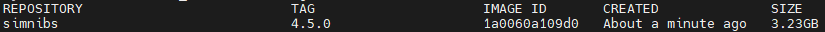

# simnibs-docker
Unofficial dockerfile for SimNIBS

## Run a container from Docker hub

Run SimNIBS 4.5.0
```
docker run -ti -v data:/opt/data oikosohn/simnibs:4.5.0
```

Run SimNIBS 4.1.0
```
docker run -ti -v data:/opt/data oikosohn/simnibs:4.1.0
```

## Build your own docker image and run it in a container

### 1. Build docker image
```
docker build -t simnibs:4.5.0 -f /path/to/dockerfile .
```

### 2. Check the built image
```
docker images
```



### 3. Run docker image
- `-v` option is used to mount a volume
```
docker run -ti -v data:/opt/data simnibs:4.5.0
```

### 4. Verify the installed version of SimNIBS in the container
```
simnibs --version
```
